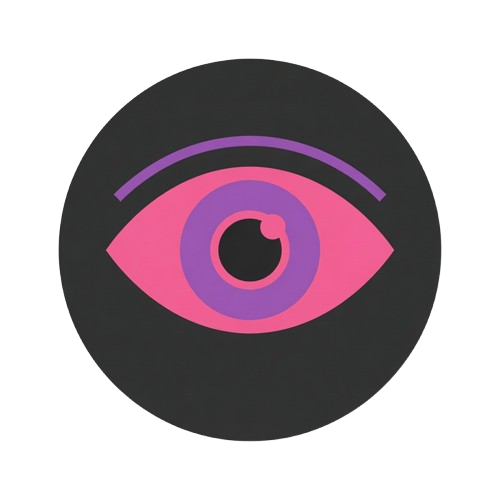

<div align="center">

[](#)
[](LICENSE)
[](https://www.python.org/)
[](https://www.gtk.org/)
[](https://github.com/AndreBFarias/project-beholder/actions/workflows/ci.yml)

<div align="center">
  <h1>Project Beholder</h1>
  
</div>

</div>

---

### Descrição

Motor autônomo de predação visual para Linux. O Beholder varre a web, captura assets de interface (ícones, vetores, fundos, logos) e os analisa via visão computacional com modelos locais via Ollama. Gera arquivos `.csv` e `.zip` estruturados prontos para consumo por outros repositórios.

---

### Principais Funcionalidades

| Modulo | Funcao |
|--------|--------|
| **Busca** | Scraping de assets por URL com modo furtivo (Playwright) |
| **Cortex** | Analise IA local via Ollama — classifica, descreve e tagueia cada asset |
| **Espolio** | Exportacao `.zip` estruturado + CSV com metadados |
| **Protocolo** | Execucao em lote com checkpoint e retomada de sessao |
| **Grimorio** | Configuracoes persistidas via XDG |

---

### Interface

<div align="center">

</div>

---

### Modelos de Visao

O Beholder suporta 3 niveis de modelo para analise de imagens, todos baixados automaticamente pelo `install.sh`:

| Tier | Modelo | VRAM | Descricao |
|------|--------|------|-----------|
| LOW | moondream | ~1.7 GB | Rapido, qualidade basica |
| MEDIUM | minicpm-v | ~2.5 GB | Equilibrio qualidade/velocidade |
| HIGH | llava:7b | ~4.5 GB | Melhor precisao, mais lento |

O tier ativo e configuravel na aba Grimorio.

---

### Instalacao

```bash
git clone git@github.com:[REDACTED]/project-beholder.git
cd project-beholder
chmod +x install.sh
./install.sh
```

O `install.sh` faz tudo automaticamente:
- Instala dependencias do sistema (GTK4, Libadwaita, GI bindings)
- Cria venv com Python do sistema (compativel com PyGObject)
- Instala dependencias Python via pip
- Baixa o binario do Ollama para `./bin/ollama`
- Baixa os 3 modelos de visao (moondream, minicpm-v, llava:7b)
- Instala Playwright com Chromium para modo furtivo
- Cria atalho `.desktop` no menu do sistema

---

### Requisitos

**Obrigatorios:**
- Linux (Ubuntu 22.04+)
- Python 3.10+
- GTK 4.0 + Libadwaita 1.x
- `python3-gi`, `python3-gi-cairo`, `gir1.2-gtk-4.0`, `gir1.2-adw-1`

**Para analise IA (Cortex):**
- Ollama binary em `./bin/ollama` (baixado automaticamente pelo `install.sh`)
- Modelos de visao (baixados automaticamente)
- GPU recomendada (NVIDIA/AMD) — funciona em CPU tambem

**Para modo furtivo (Busca):**
- Playwright: instalado automaticamente pelo `install.sh`

---

### Execucao

```bash
./run.sh
```

O `run.sh` verifica o venv, confere se todos os modelos de visao estao disponiveis (baixa os ausentes), limpa estado residual do Ollama e inicia o app. Ao fechar, libera a VRAM automaticamente.

---

### Desenvolvimento

```bash
just ci-local    # lint + formato + testes (97 testes)
just test        # apenas testes
just lint        # apenas lint e formato
just fmt         # corrigir formato automaticamente
just run         # iniciar o app
```

---

### Estrutura do Projeto

```
project-beholder/
  main.py                        # Entry point
  install.sh                     # Instala tudo automaticamente
  run.sh                         # Inicia o app com ciclo de vida completo
  uninstall.sh                   # Remove venv, bin, dados e atalho
  teardown.sh                    # Limpeza forcada (emergencia)
  src/
    gui/
      pages/                     # 5 modulos: busca, cortex, espolio, protocolo, grimorio
      widgets.py                 # LogTerminal, StatusBar
      theme.py                   # CSS Dracula (spec-compliant)
      sidebar.py                 # Navegacao lateral
      main_window.py             # Janela principal GTK4
    scraper/
      stealth_spider.py          # Thread A — scraping + Playwright
      html_parser.py             # Extracao de assets do HTML
    ai_vision/
      orchestrator.py            # Thread B — bridge Ollama (ADR-01)
      ollama_lifecycle.py        # Gerenciamento de VRAM (ADR-03)
      moondream_prompt.py        # Prompt estruturado JSON
    transformer/
      icon_alchemist.py          # K-Means + canvas circular
    exporter/
      packer.py                  # Thread C — .zip
      dataset_writer.py          # CSV
    core/
      asset_queue.py             # Filas inter-thread com backpressure
      checkpoint.py              # Serializacao de estado
      config/
        defaults.py              # Fonte unica de verdade (ADR-02)
        config.py                # Persistencia XDG
  tests/
    unit/                        # Testes unitarios (pytest)
    smoke/                       # Smoke tests de importacao
  docs/
    adr/                         # Decisoes de arquitetura
    sprints/                     # Documentacao das sprints
```

---

### ADRs (Decisoes de Arquitetura)

| ADR | Regra |
|-----|-------|
| ADR-01 | Threads NUNCA tocam widgets — obrigatorio `GLib.idle_add()` |
| ADR-02 | `defaults.py` e a unica fonte de verdade para configuracoes |
| ADR-03 | Ollama sempre em `./bin/ollama` porta 11435 — kill pelo PID exato |

---

### Documentacao

- [GSD.md](GSD.md) — Armadilhas criticas e estado das sprints
- [CLAUDE.md](CLAUDE.md) — Regras de desenvolvimento
- [docs/adr/](docs/adr/) — Decisoes de arquitetura
- [docs/sprints/](docs/sprints/) — Historico e backlog de sprints

---

### Licenca

GPL-3.0 — Veja [LICENSE](LICENSE) para detalhes.
